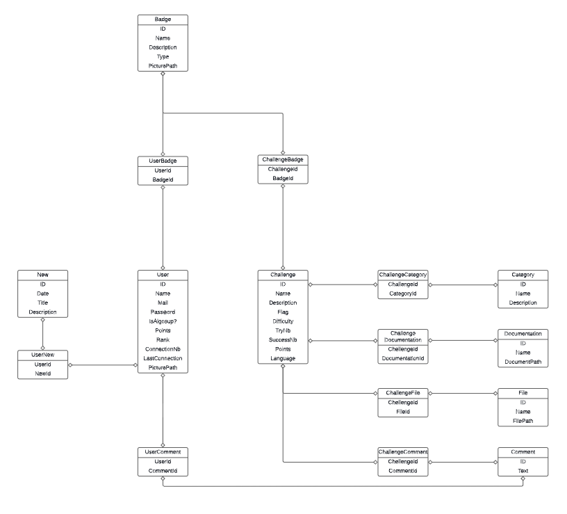

# Technical Specifications - CASC
## Document Control

**Document Information:**
| | Information |
| --- | --- |
| Document Owner | Maxime CARON |
| Creation Date | 2024-03-24 |
| Last Updated | 2024-05-04 |
| Document Name | Technical Specifications - CASC |

**Version History:**
| Version | Date | Author | Description |
| --- | --- | --- | --- |
| 0.1 | 2024-03-24 | Maxime CARON | Initial draft |
| 0.2 | 2024-05-04 | Maxime CARON | Update structure and texts |
## Summary

Click to expand!

- [Technical Specifications - CASC](#technical-specifications---casc)
  - [Document Control](#document-control)
  - [Summary](#summary)
  - [Background Information](#background-information)
    - [Project Scope](#project-scope)
    - [Services](#services)
  - [Server Specifications](#server-specifications)
    - [Hardware](#hardware)
    - [Software](#software)
  - [Database](#database)
    - [Data model](#data-model)
    - [Syncronization with the server](#syncronization-with-the-server)
    - [Migration between versions](#migration-between-versions)
    - [Backup](#backup)
  - [App](#app)
    - [Frontend](#frontend)
    - [Code Compilation and Execution](#code-compilation-and-execution)
    - [Administration](#administration)
      - [**Admin:**](#admin)
      - [**Moderator:**](#moderator)
    - [Authentication](#authentication)
      - [**ALGOSUP Students:**](#algosup-students)
      - [**Other Users:**](#other-users)
  - [Exercises](#exercises)
    - [Code Correction](#code-correction)
    - [Server Code](#server-code)
    - [Code Upload](#code-upload)
  - [Resources and Constraints](#resources-and-constraints)
    - [Resources](#resources)
    - [Constraints](#constraints)
  - [Risks and Mitigation](#risks-and-mitigation)
  - [Overall Plan](#overall-plan)
  - [Glossary](#glossary)

## Background Information
As a student at ALGOSUP school, I've observed that many new students struggle with understanding fundamental programming concepts such as algorithms, modularity, and classes. Fortunately, as part of my cursus, I am required to imaginate and realize a project. In response to this need, I have conceptualized CASC, a web application aimed at assisting novice developers in acquiring and improving their programming skills. Through a curated selection of exercises and lessons, beginners will be guided into the world of algorithms.

### Project Scope
CASC is a web application designed to support new developers acquire and increase their programming skills. By offering a diverse range of exercises and accompanying documentation, users will gain proficiency in essential algorithmic concepts. 

These exercises will be categorized into different types:
- Code Correction:
  - Users will be presented with code containing errors that they must identify and rectify. Upon successful correction, users can execute the code and view the output. Validation is confirmed by a code flag.
- Server Code:
  - In this exercise type, users will engage with a server via a REST API. Users will receive data from the server and must submit a response. Successful completion and validation result in the display of a confirmation flag.
- Code Upload:
  - Users will be tasked with uploading a piece of code to be executed within a restricted environment. Validation occurs upon passing all tests specified for the code, confirming the exercise's completion.

### Services

The project will be segmented into three core services:

- Server:
  - This service will serve as the hosting platform for both the application and the database.
- Database:
  - Responsible for storing all application-related data, this service forms the backbone of CASC's information management.
- App:
  - The web application interface where users will engage with CASC's features and content.

## Server Specifications

### Hardware
Server is a virtual machine working on a physical server. The server will have the following hardware specifications:
- CPU: i5-6300HQ
- RAM: 32 GB
- Storage: 2 TB SSD

### Software
The server runs on the Linux operating system, a versatile family of open-source Unix-like platforms renowned for their stability and security. The server will serve as the primary hosting environment for the CCAC's application and database components. In addition, it will facilitate the deployment and orchestration of a Kubernetes cluster, enabling seamless scaling and management of containerized workloads. In addition, the server will play a central role in the operation of Docker containers, enabling efficient encapsulation and deployment of application services in isolated environments.

## Database
CASC will utilize MariaDB, a renowned open-source relational database system developed by the creators of MySQL.

### Data model
The initial database model for the first version of CASC is this one:

</img>

See bigger [here](../appendix/DB_CASC.pdf).

This model serves as the foundation for structuring and organizing the application's data entities and relationships.

### Syncronization with the server
Database synchronization will be seamlessly facilitated through Active Record, the Object-Relational Mapping (ORM) framework integrated within the Ruby on Rails framework. Using Active Record, CASC will interact with the database without the need for direct SQL queries, simplifying data management operations and enhancing developer productivity.

### Migration between versions
Ensuring the seamless evolution of the database schema, CASC will employ Active Record migrations for version-to-version database schema transitions. Active Record migrations provide a standardized and reliable mechanism for altering the database structure while maintaining data integrity. In the event of a rollback scenario, Active Record empowers CASC to revert to a previous database schema version swiftly and efficiently

### Backup

To mitigate the risk of data loss, CASC employs a comprehensive backup strategy. Regular backups of the database are scheduled to occur every two weeks. Using the capabilities of Docker, these backups are efficiently created, capturing the state of the database at specific points in time.

The backup files are securely stored on a separate, dedicated server, ensuring data availability even in the face of hardware failures or unexpected disruptions. This separation of storage locations enhances the resilience of CASC's data infrastructure, safeguarding against potential loss or corruption.

By implementing robust backup procedures, CASC demonstrates a steadfast commitment to preserving data integrity and resilience. These measures not only enhance the reliability of the application but also instill confidence in users regarding the safety and security of their data.

Every backup will be stored for 2 months.

## App
CASC is designed as a dynamic web application that provides an intuitive and interactive platform for users to engage with its educational content. Leveraging the power and flexibility of the Ruby on Rails framework, the application is poised to deliver a seamless user experience.

### Frontend
CASC adopts the modern and versatile Tailwind CSS framework for frontend development. By harnessing Tailwind CSS's utility-first approach, the application achieves a sleek, responsive, and visually captivating user interface, enhancing user engagement and navigation efficiency.

### Code Compilation and Execution
In CASC, code compilation and execution are seamlessly orchestrated within a virtualized environment powered by nanovms nanos. Leveraging nanovms nanos, code execution is performed securely and efficiently within isolated virtual machines, ensuring robustness and stability across diverse programming exercises and scenarios.

### Administration
#### **Admin:**
The application features an admin interface tailored for comprehensive management of exercises, documentation, and user accounts. Administrators possess the authority to create, update, and delete exercises and documentation. Additionally, they hold the privilege to manage user accounts, overseeing user access and permissions within the system.

#### **Moderator:**
In addition to administrators, the application grants moderator privileges to designated users. Moderators wield similar capabilities to administrators, enabling them to oversee and maintain the integrity of exercises, documentation, and user interactions within the platform.

### Authentication
Authentication within CASC is tailored to cater to the diverse needs of its user base:

#### **ALGOSUP Students:**
Students enrolled at ALGOSUP are authenticated via their institutional email addresses. Upon authentication, they gain access to exclusive rewards and events, tailored to augment their learning journey and incentivize engagement with the platform.

#### **Other Users:**
For users beyond the ALGOSUP student community, access to exercises is granted upon successful authentication. However, access to exclusive rewards is restricted, ensuring equitable access to educational resources while preserving the integrity of the rewards system.

## Exercises
The application will contain exercises to help users learn algorithmic concepts. The exercises will be divided into different type:
- Code Correction
- Server Code
- Code Upload

### Code Correction
Code Correction exercises will present a piece of code with errors. The user will have to identify and correct the errors. Once the code is fully corrected the user will be able to execute it and see the returned flag. The is a code to valide the exercise.

### Server Code
- Use rest API to communicate with server

### Code Upload
- Run it into docker container
	- Restricted resources
	- Restricted access
	- etc...

## Resources and Constraints

### Resources

For this project, the following resources will be required:
- A server to host the application
- A database to store the exercises and the documentation
- A Kubernetes cluster to manage the containers
- A Git repository to store the code
- A Linux server to host the Kubernetes cluster
- A REST API to communicate with the server

### Constraints

The following constraints will be taken into account:
- The application must differentiate ALGOSUP students from other users.
- Exercises must incorporate a gradual level of difficulty.
- The application must be accessible from any web browser.
- The application must be straightforward to maintain and update.
- The application must have a first release date of 2024-09-01.
- The application must respect user privacy.
- The application must be developed using the following technologies:
    - Ruby on Rails
    - MySQL
    - Docker
    - Kubernetes
    - Linux

## Risks and Mitigation

| Risk | Mitigation |
| --- | --- |
| Server failure | Regular backups will be performed to prevent data loss. |
| Database corruption | Regular backups will be performed to prevent data loss. |
| Code errors | Code reviews will be performed to identify and correct errors. |
| Data loss | Regular backups will be performed to prevent data loss. |
| Server overload | Load balancing will be implemented to distribute the load across multiple servers. |
| Hardware failure | Regular hardware checks will be performed to identify and replace faulty hardware. |
| Software failure | Regular software updates will be performed to prevent software failures. |

## Overall Plan

To ensure the success of the project, the team will follow the following plan for the development part:
| Priority | Task | Description | Phase |
| --- | --- | --- | --- |
| 1 | Database design | The database will be designed to store the exercises and the documentation. | Prototype |
| 2 | Server setup | The server will be set up to host the application. | Prototype |
| 3 | App development | The application will be developed with Ruby on Rails. | Prototype |
| 4 | Code Correction | Code Correction exercises will be developed. | Prototype |
| 5 | Code Upload | Code Upload exercises will be developed. | Prototype |

## Glossary

| Term | Definition |
| --- | --- |
| ALGOSUP | A school that teaches programming. |
| Web browser | A software that allows you to access the web. |
| Kubernetes | An open-source container orchestration system for automating application deployment, scaling, and management. |
| Docker | A platform for developing, shipping, and running applications in containers. |
| MySQL | An open-source relational database management system based on SQL – Structured Query Language. |
| Go | An open-source programming language that makes it easy to build simple, reliable, and efficient software. |
| Beego | A web application framework for the Go programming language. |
| REST API | A set of rules that developers follow when they create their application. |
| Linux | A family of open-source Unix-like operating systems based on the Linux kernel. |
| Code Correction | An exercise that presents a piece of code with errors. The user has to identify and correct the errors. |
| Code Upload | An exercise that requires the user to upload a piece of code. The code is then executed in a restricted environment. |
| Server Code | An exercise that requires the user to interact with a server using a REST API. |
| Load balancing | The process of distributing network traffic across multiple servers to ensure no single server is overwhelmed. |
| Redundant network | A network that has multiple paths to ensure network connectivity in case of a failure. |
| Redundant power supply | A power supply that has multiple power sources to ensure power availability in case of a failure. |
| Code review | A process in which developers review each other's code to identify and correct errors. |
